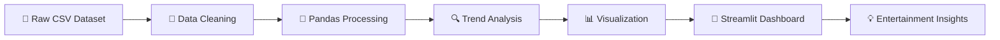

<div align="center">

# 🎬 Entertainment Popularity Trend Analyzer

### 📊 Discover • Analyze • Visualize • Understand


<br/>


<br/><br/>

<a href="https://github.com/vedantyerne1-art/entrertainment-popularity-trend-analyzer">

</a>

<a href="https://github.com/vedantyerne1-art/entrertainment-popularity-trend-analyzer">

</a>

<a href="https://github.com/vedantyerne1-art/entrertainment-popularity-trend-analyzer">

</a>

</div>

---

## 🚀 About The Project

**Entertainment Popularity Trend Analyzer** is an interactive data analytics dashboard designed to explore and understand **entertainment popularity trends** from historical U.S. Top 50 playlist data.

The project transforms raw entertainment data into meaningful visual insights, helping users understand:

* 📈 Popularity trends
* 👀 Viewership patterns
* ❤️ Engagement behavior
* 🎵 Entertainment performance
* 📊 Category-level insights
* 🔥 Trending content patterns

The dashboard is built using **Python + Streamlit**, making the analysis interactive and accessible directly through a web browser.

---

## ✨ What Makes It Interesting?

```text
              RAW ENTERTAINMENT DATA
                       │
                       ▼
                ┌─────────────┐
                │   Pandas    │
                │ Data Engine  │
                └──────┬──────┘
                       │
                       ▼
              ┌─────────────────┐
              │ Data Processing │
              │ & Transformation│
              └────────┬────────┘
                       │
                       ▼
               📊 Visualization
                       │
                       ▼
              ┌─────────────────┐
              │    Streamlit    │
              │    Dashboard    │
              └────────┬────────┘
                       │
                       ▼
                💡 INSIGHTS
```

---

# 🎯 Key Features

| Feature                  | Description                                          |
| ------------------------ | ---------------------------------------------------- |
| 📊 Interactive Dashboard | Explore entertainment data through an interactive UI |
| 📈 Trend Analysis        | Understand popularity patterns over time             |
| 🔥 Popularity Insights   | Identify high-performing entertainment content       |
| 📉 Data Visualization    | Convert raw data into meaningful charts              |
| 📱 Mobile Friendly       | Dashboard designed for different screen sizes        |
| 🧹 Data Processing       | Clean and transform raw CSV data                     |
| ⚡ Fast Analysis          | Lightweight Python-based analytics                   |
| 🧠 Research Support      | Includes supporting research documentation           |

---

# 🛠️ Tech Stack

<div align="center">

| Technology            | Purpose                     |
| --------------------- | --------------------------- |
| 🐍 **Python**         | Core programming language   |
| 🎈 **Streamlit**      | Interactive dashboard       |
| 🐼 **Pandas**         | Data processing & analysis  |
| 📊 **Matplotlib**     | Data visualization          |
| 📁 **CSV**            | Dataset storage             |
| 🔬 **Data Analytics** | Trend & popularity analysis |

</div>

---

# 📂 Project Structure

```text
entrertainment-popularity-trend-analyzer/
│
├── 📄 app.py
│   └── Main Streamlit application
│
├── 📊 Atlantic_United_States.csv
│   └── Entertainment dataset
│
├── 📄 research_summary.md
│   └── Research findings and analysis
│
├── 📄 requirements.txt
│   └── Python dependencies
│
├── 📄 runtime.txt
│   └── Runtime configuration
│
├── 📄 .gitignore
│   └── Ignored files
│
└── 📄 README.md
    └── Project documentation
```

---

# ⚙️ Installation

### 1️⃣ Clone the repository

```bash
git clone https://github.com/vedantyerne1-art/entrertainment-popularity-trend-analyzer.git
```

### 2️⃣ Enter the project directory

```bash
cd entrertainment-popularity-trend-analyzer
```

### 3️⃣ Create a virtual environment

```bash
python -m venv venv
```

### 4️⃣ Activate the environment

### Windows

```bash
venv\Scripts\activate
```

### Linux / macOS

```bash
source venv/bin/activate
```

### 5️⃣ Install dependencies

```bash
pip install -r requirements.txt
```

### 6️⃣ Run the application

```bash
streamlit run app.py
```

---

# 🖥️ Dashboard Workflow

```text
        📁 Dataset
           │
           ▼
      🧹 Data Cleaning
           │
           ▼
      🔍 Data Analysis
           │
           ▼
     📊 Visualization
           │
           ▼
    🎛️ Interactive Filters
           │
           ▼
       💡 Insights
```

---

# 📊 Data Analysis

The project focuses on extracting meaningful patterns from entertainment popularity data.

### 🔎 Questions explored

**1. Which entertainment content performs best?**

Analyze popularity metrics to identify high-performing content.

**2. How does popularity change over time?**

Study historical patterns and identify periods of increased interest.

**3. What characteristics are associated with popular content?**

Compare different attributes and engagement indicators.

**4. What trends can be observed from historical data?**

Use visualization and statistical analysis to uncover patterns that may not be obvious from raw data.

---

# 📈 Analytics Pipeline



---

# 🎨 Dashboard Concept

```text
╔══════════════════════════════════════════════════╗
║       🎬 ENTERTAINMENT TREND ANALYZER            ║
╠══════════════════════════════════════════════════╣
║                                                  ║
║   📊 Popularity      📈 Trends      🔥 Top Data  ║
║                                                  ║
║   ┌────────────┐   ┌────────────────────────┐    ║
║   │  METRICS   │   │                        │    ║
║   │            │   │     📈 TREND CHART     │    ║
║   │  👀 Views  │   │                        │    ║
║   │  ❤️ Likes  │   │                        │    ║
║   │  💬 Engage │   │                        │    ║
║   └────────────┘   └────────────────────────┘    ║
║                                                  ║
║          🔎 Explore • Compare • Discover         ║
╚══════════════════════════════════════════════════╝
```

---

# 🔬 Research Component

This repository also contains a dedicated research summary covering the analytical findings obtained from the dataset.

📄 **Research documentation:**

```text
research_summary.md
```

The research component helps connect the dashboard with the underlying **data-analysis methodology and observations**.

---

# 🌐 Deployment

The application is designed for **Streamlit Community Cloud** deployment.

### Deployment flow

```text
GitHub Repository
       │
       ▼
Streamlit Community Cloud
       │
       ▼
    app.py
       │
       ▼
🚀 Live Dashboard
```

The repository's current documentation identifies Streamlit Community Cloud as the supported one-click deployment target for this Streamlit application.

---

# 💻 Run Locally

After installing the dependencies:

```bash
streamlit run app.py
```

Then open the local Streamlit address shown in your terminal.

Make sure:

```text
Atlantic_United_States.csv
```

is located beside:

```text
app.py
```

as required by the current project setup.

---

# 📸 Screenshots

> Add screenshots of your dashboard here to make the repository more attractive.

```text
📸 dashboard.png
📸 analytics.png
📸 trends.png
```

You can later replace this section with:

```markdown

```

---

# 🚀 Future Improvements

The project can be expanded with:

* 🤖 Machine Learning-based popularity prediction
* 🔮 Future trend forecasting
* 🧠 Recommendation system
* 🌎 Multi-country entertainment analysis
* 📡 Real-time trend monitoring
* 📊 Advanced statistical analysis
* 🗺️ Geographic trend visualization
* 🔥 Viral-content detection
* 🎯 Popularity scoring
* 📱 Improved responsive dashboard
* ☁️ Cloud-based data pipeline

---

# 🧠 Possible ML Extension

A future version could introduce a **Popularity Prediction Engine**:

```text
Historical Data
      │
      ▼
Feature Engineering
      │
      ▼
Machine Learning Model
      │
      ├── Random Forest
      ├── XGBoost
      └── Regression
      │
      ▼
Popularity Score
      │
      ▼
🔮 Trend Prediction
```

This would transform the project from a **descriptive analytics dashboard** into a more advanced **predictive entertainment intelligence system**.

---

# 📌 Project Goals

```text
             🎬 ENTERTAINMENT
                    │
          ┌─────────┴─────────┐
          ▼                   ▼
       📊 DATA              🔍 ANALYSIS
          │                   │
          └─────────┬─────────┘
                    ▼
              📈 TRENDS
                    │
                    ▼
              💡 INSIGHTS
                    │
                    ▼
             🚀 BETTER DECISIONS
```

---

# 👨‍💻 Author

<div align="center">

### Vedant Yerne

**CSE (IoT) | Data Analytics | AI/ML | Software Development**

<br/>

<a href="https://github.com/vedantyerne1-art">

</a>

</div>

---

# ⭐ Support

If you find this project useful:

⭐ **Star the repository**

🍴 **Fork the project**

🐛 **Report issues**

💡 **Suggest improvements**

---

<div align="center">

### 🎬 Analyze the Trends. Discover the Patterns. Predict the Future.


</div>
